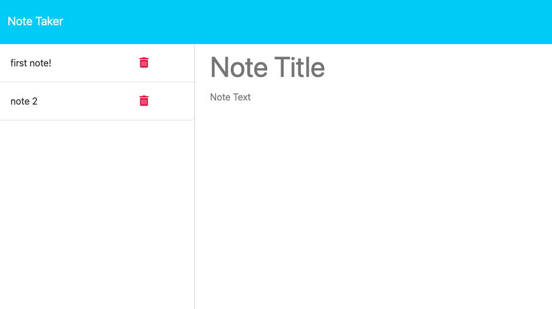

# Note taker      

  ## Description

  This is a note taker app where users can keep track of their thoughts and ideas by posting notes. The website features a landing page and notes page where new notes can be added and existing notes can be read. The note taker app utilizes Node.js and an express server. 
    

  ## Table of Contents

  [Installation](#installation)

  [Usage](#usage)

  [License](#license)

  [Contributing](#contributing)

  [Credits](#credits)

  [Tests](#tests)

  [Screenshot](#screenshot)

  [Link](#link)

  [Questions](#questions)

  ## Installation 

  N/A

  ## Usage 

  To use the note taker, click the get started button on the landing page. Once on the notes page, add a new note by entering a title and text and then clicking the save note button in the upper right corner. To revisit an existing note, click on the note title in the left-hand sidebar. 

  ## License 

  This application is covered under a(n) <a href = "https://opensource.org/licenses/MIT">MIT</a> license

  ## Contributing 

  N/A

  ## Credits 

  UUID function from activity 19 in the express module (class materials).

  ## Tests 

  N/A

  ## Screenshot 

  

  ## Link 

  https://obscure-everglades-50014-854306406bb4.herokuapp.com/
  

  ## Questions 

  Feel free to reach out to me with any additional questions!

  GitHub: <a href="https://github.com/elisestankus"> elisestankus</a>